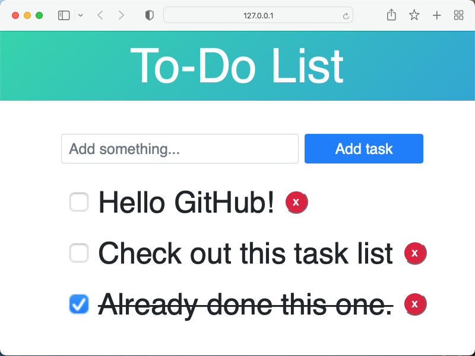

# JS-To-Do-List

This is a very basic To Do List application that uses the browsers local storage to keep the items in memory. It was primarily built to enhance my JavaScript skills and learn more about local storage.

## Get started

Since it is a very plain project, you can just clone this repo and view the `index.html` in your browser or use an existing web server (like [live server](https://github.com/ritwickdey/vscode-live-server)).

Or you can see a live demo [here](https://dan-koller.github.io/JS-To-Do-List).

## Stack

-   HTML
-   CSS, Bootstrap
-   JavaScript
